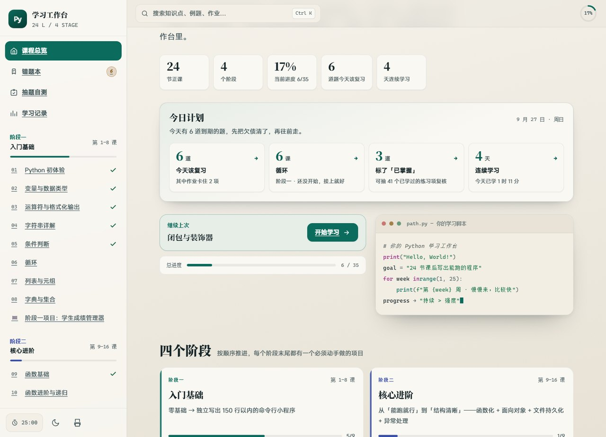
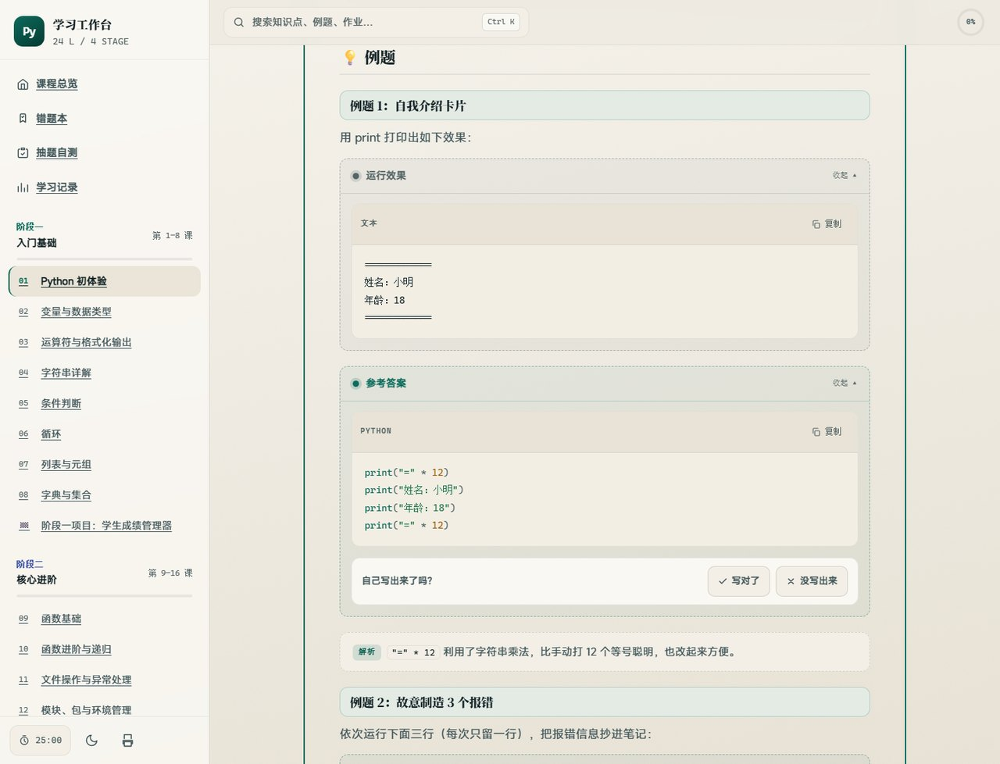
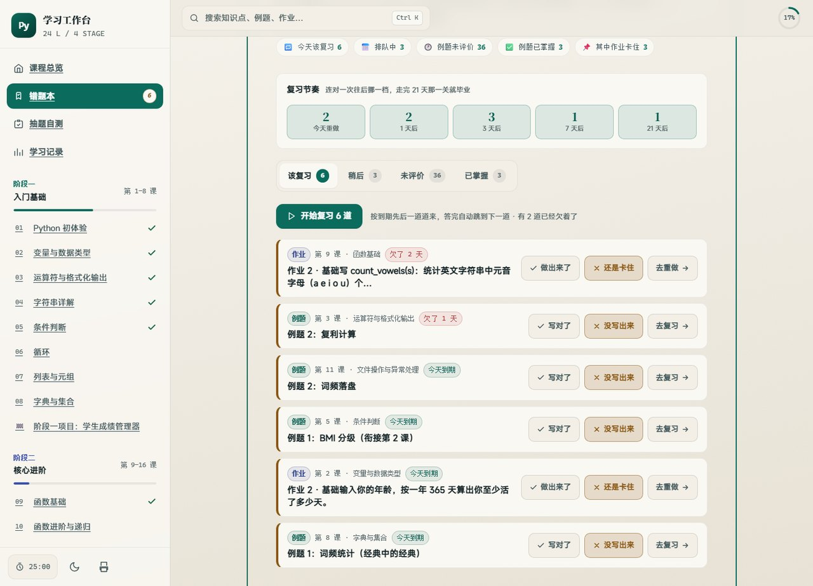
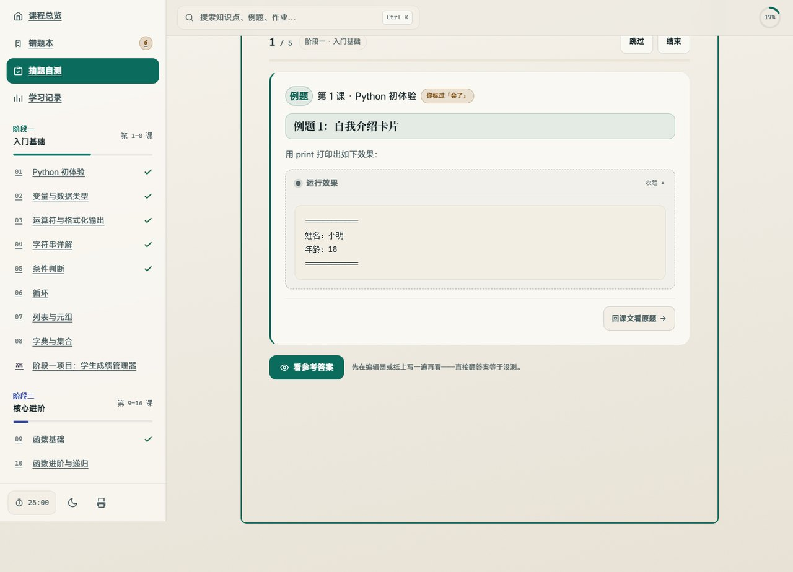
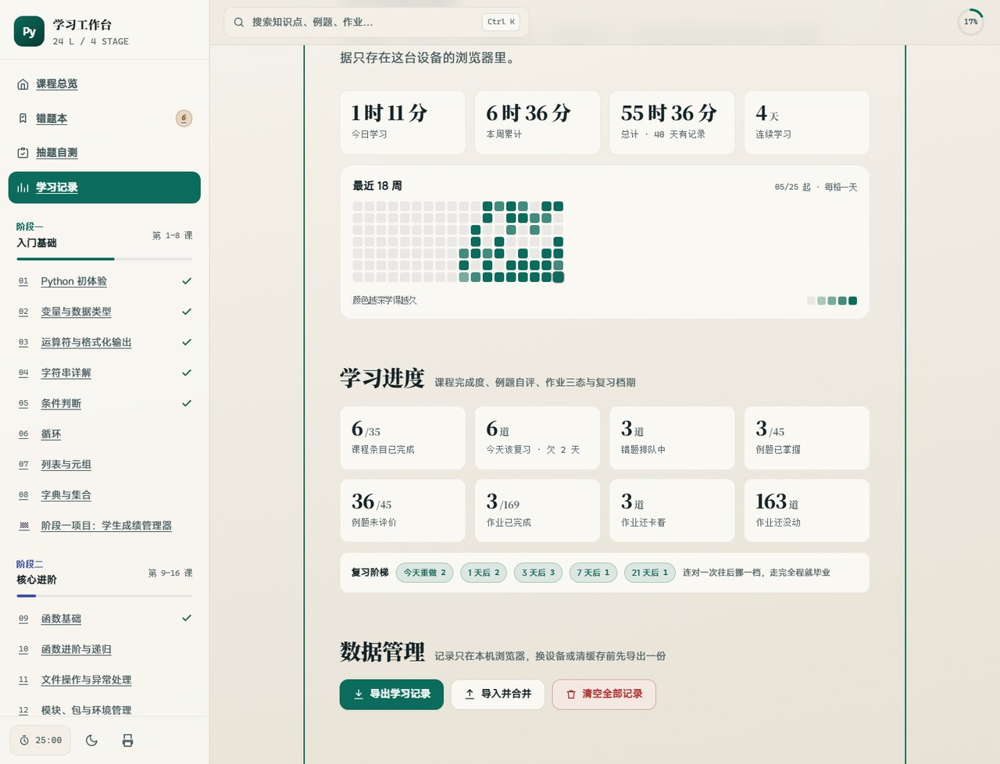
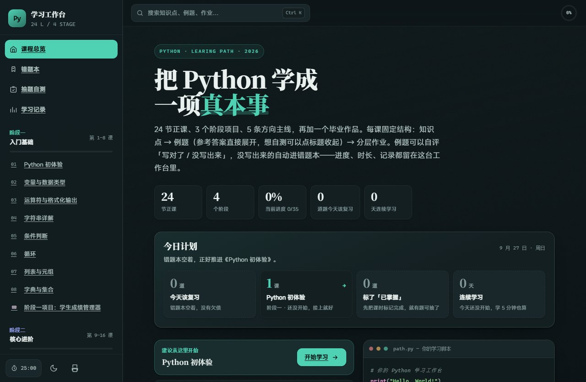

# Python 系统化学习路径（入门 → 进阶）

一套写给自学者的完整 Python 课程：**24 节正课 + 3 个阶段项目 + 5 条方向主线 + 1 个毕业作品**，配一台**单文件、离线、零依赖**的学习工作台——把「学过」变成「练过、记住了、拿得出手」。

**[🌐 在线打开工作台](https://zyvn-coder.github.io/python-learning-path/)** · **[⬇️ 下载单文件 HTML](python-学习工作台.html)**（双击即用，不用联网、不用装任何东西） · **[📖 从第一课开始](01-入门基础.md)**

---

## 📸 界面预览

**① 今日计划｜首页最上面四张行动卡**

**② 课时页｜例题、运行效果、参考答案与自评**

参考答案默认展开——例题本身就是教学内容，藏起来等于把课文上了锁；想自测时点标题收起即可。看完自己判「写对了 / 没写出来」，没写出来的自动进错题本。

**③ 错题本｜间隔复习的排期与阶梯**

只收你标过「没搞定」的题。每道题按 1 → 3 → 7 → 21 天滚动复习：答对升一档，走完 21 天算掌握；答错立刻重置，明天重做。

**④ 抽题自测｜从全部 214 个练习项里随机抽**

优先抽「你可能以为会了」的——错题本只重做错过的，自测补的正是这个缺口。出题时答案遮住，揭示后才出现自评那一排。

**⑤ 学习记录｜时长、热力图与复习分布**

**⑥ 深色模式｜和 ① 是同一个页面，便于对照**

## 这是什么

一门「能自己走完」的 Python 课。比起常见的教程合集，它多做了三件事：

1. **每道题都有明确去处。** 例题自评、作业标三态，标过「没搞定」的自动进错题本——不用自己维护一份笔记来记住哪里不会。
2. **复习有排期，不靠自觉。** 答对的题按 1 → 3 → 7 → 21 天滚动复习，走完 21 天算掌握，答错的明天重做。
3. **每天打开就知道该干什么。** 首页「今日计划」四张卡：先清欠债 → 再往前走 → 复核已掌握 → 保持节奏。

它不是「读完就完」的电子书：**214 个可勾选的练习项**，每一课都以动手收尾。

### 课程规模

| 项目 | 数量 |
|---|---|
| 正课 | 24 节，分 4 个阶段 |
| 阶段项目 | 3 个（每个阶段末尾一个，必须动手做） |
| 方向主线 | 5 条，任选其一深入 |
| 毕业作品 | 三选一，含 9 项验收标准 |
| 知识点 | 143 条 |
| 例题 | 45 道，**全部带参考答案与解析** |
| 作业 | 169 项，分基础 / 进阶 / 挑战三档 |
| 可勾选练习项 | **214 个**（＝ 45 道例题 + 169 项作业） |

### 适合谁

- **完全零基础**，想要一条有始有终的路线，而不是零散视频合集。
- **自学过但没坚持下来**，需要「每天都有人告诉你该做什么」这种外部约束。
- **想系统补一遍基础**，尤其是文件、异常、面向对象、并发这些「知道但没亲手写过」的部分。

**不太适合**：想三天速成的人；想直接要作业答案的人（作业只给思路提示，逼你自己写）；已有多年工程经验、想深入分布式或框架源码的人——这条路线走到毕业项目，约等于初级工程师的语法与工程底线。

## ✨ 工作台里有什么

| 功能 | 说明 |
|---|---|
| **今日计划** | 首页四张行动卡，各自直达该去的地方；欠债还清后自动换下一条建议 |
| **进度追踪** | 35 个页面、214 个练习项逐个勾选；侧栏实时显示每个阶段的完成度 |
| **例题自评** | 参考答案默认展开；看完自判「写对了 / 没写出来」 |
| **作业三态** | 已完成 / 卡住 / 未做；「卡住」的自动进错题本 |
| **错题本** | 只收标过「没搞定」的题，例题与作业混排、各带来源徽章 |
| **间隔复习** | 1 → 3 → 7 → 21 天排期，答对升档、答错重置 |
| **抽题自测** | 从全部 214 个练习项随机抽，优先抽「你可能以为会了」的；可限定范围与题量 |
| **学习记录** | 时长统计、学习热力图、复习阶梯分布、连续学习天数 |
| **导出 / 导入** | 进度存在浏览器本地，可导出 JSON 备份、换设备导入 |
| **深色模式** | 浅 / 深两套主题；移动端与窄屏已适配 |

工作台是**单个 HTML 文件**：不需要服务器、不需要安装、不请求任何外部资源。双击就能用，拷进 U 盘带走也行。

## 📚 课程大纲

### 阶段一 · 入门基础（第 1–8 课 · 建议 4–5 周）

零基础 → 独立写出 150 行以内的命令行小程序。

`1` Python 初体验 · `2` 变量与数据类型 · `3` 运算符与格式化输出 · `4` 字符串详解 · `5` 条件判断 · `6` 循环 · `7` 列表与元组 · `8` 字典与集合

🏁 **阶段项目**：学生成绩管理器

[打开阶段一 →](01-入门基础.md)

### 阶段二 · 核心进阶（第 9–16 课 · 建议 5–6 周）

从「能跑就行」到「结构清晰」——函数化 + 面向对象 + 文件持久化 + 异常处理。

`9` 函数基础 · `10` 函数进阶与递归 · `11` 文件操作与异常处理 · `12` 模块、包与环境管理 · `13` 面向对象基础 · `14` 面向对象进阶 · `15` 推导式、迭代器与生成器 · `16` 常用标准库速览

🏁 **阶段项目**：命令行待办事项管理器

[打开阶段二 →](02-核心进阶.md)

### 阶段三 · 高级应用（第 17–24 课 · 建议 6–8 周）

从「会写代码」到「会写工程」——装饰器、并发、网络、数据库、测试。

`17` 闭包与装饰器 · `18` 类型注解与代码规范 · `19` 正则表达式 · `20` 并发编程 · `21` 异步编程 asyncio · `22` 网络请求与 API · `23` 数据库操作（sqlite3 与 ORM 初探） · `24` 测试、调试与日志

🏁 **阶段项目**：资讯聚合命令行工具

[打开阶段三 →](03-高级应用.md)

### 阶段四 · 方向拓展与毕业项目（建议 4–8 周）

按目标选 **1 条**主线深入，做出可展示、能放 GitHub 的毕业作品。贪多嚼不烂。

| 方向 | 适合谁 |
|---|---|
| **A · 数据分析** | 想处理和可视化数据、往数据岗走 |
| **B · Web 开发** | 想做能给别人用的网站或接口 |
| **C · 自动化办公** | 想先解决手头重复劳动（Excel、文件、报表） |
| **D · 爬虫（数据采集）** | 想批量获取公开数据，注意合规与礼貌抓取 |
| **E · AI 应用开发** | 想调用大模型 API 做出可用的智能应用 |

选不定就打开工作台的「怎么选方向」页——五张卡片对应五个目标，点开就地展开该方向的知识点与练习题，不用来回跳。

🎓 **毕业项目（三选一）**：9 项验收标准，全部勾上即达成。工作台首页会在你走完正课和三个阶段项目后自动多出一张毕业里程碑卡，从「该做毕业项目了」到「毕业项目已达成」，不用自己记还差多少。

[打开阶段四 →](04-方向拓展与毕业项目.md)

## 🎯 每一课都这样学

1. **读知识点**（约 20 分钟）：对照代码块理解概念，不要死记。
2. **做例题**（约 30 分钟）：先自己写，再展开参考答案对比；想不通就逐行加 `print` 调试。
3. **写作业**（40–60 分钟）：基础题必做 → 进阶题尽量做 → 挑战题选做；**独立挣扎至少 30 分钟再看提示**。
4. **记笔记**：用自己的话写「这课我踩了什么坑」，两周后回看一次。

⚠️ 三条铁律：

- 所有代码必须**亲手敲**，禁止复制粘贴；
- 上一课的基础作业没做完，不进入下一课；
- 每个阶段的**项目必须做**——项目才是检验学会的唯一标准。

## 🛠️ 开课前准备

1. 安装 Python 3.12+：<https://www.python.org/downloads/>（Windows 安装时务必勾选 **Add Python to PATH**）
2. 安装编辑器：VS Code + Python 扩展，或 PyCharm Community
3. 打开终端验证：`python --version`

## ✅ 里程碑自测

学完每个阶段，你应该能做到：

- [ ] **阶段一**：不查资料写出「猜数字游戏」（循环 + 判断 + 随机数 + 输入处理）
- [ ] **阶段二**：独立写出「带 JSON 文件存储的命令行待办事项管理器」（函数 + 类 + 文件 + 异常）
- [ ] **阶段三**：会写测试、会用装饰器、会请求 API 并入库，代码通过 mypy / ruff 检查
- [ ] **阶段四**：完成一个可展示、放 GitHub 的毕业项目

> 用工作台的话，这一节在首页是**可以勾的卡片**，勾选状态和进度一起保存。

## 📁 仓库结构

| 路径 | 说明 |
|---|---|
| `01-` ~ `04-*.md` | **课程内容源**，唯一的内容出处 |
| `python-学习工作台.html` | **编译产物**：单文件、离线、零外部依赖，双击即用 |
| `index.html` | 同一份产物，给 GitHub Pages 当站点首页用 |
| `LICENSE` | 许可协议（CC BY-NC-SA 4.0） |
| `assets/` | README 用的界面截图 |
| `tools/` | 编译器与验收工具，[见说明](tools/README.md) |

改课程只需编辑那四份 `.md`，然后 `python tools/build.py` 重新生成工作台——一次构建同时写出上面两份 HTML，内容一致，不存在「改完忘同步」。

`tools/` 里还有一套**无头浏览器验收**（17 个场景 / 640 项断言），覆盖交互、响应式、键盘可达与 WCAG 对比度，用来保证改动没有破坏既有行为。细节见 [`tools/README.md`](tools/README.md)。

> 只读课程的话完全不用管 `tools/`，双击 HTML 即可。

## ❓ 常见问题

**Q：每天只有 30 分钟怎么办？**
把「一周」当最小单位：一周吃透 1 课 + 重做上周作业，总时长拉长即可。

**Q：作业完全不会做？**
按顺序：① 回看知识点代码块 → ② 重做例题 → ③ 读作业提示 → ④ 把提示里的函数名查官方文档（<https://docs.python.org/zh-cn/3/>）。

**Q：想要作业的完整参考答案？**
本套课程例题全部带答案，作业只带思路提示（逼你思考）。做完后可以让 AI 批改，或把你的解法和例题答案对照。

**Q：学完能找到工作吗？**
本路径到阶段三 ≈ 初级工程师的语法底线。能否就业取决于阶段四的方向深度 + 项目经验 + 计算机基础（数据结构 / 网络 / 数据库），需要另配资源。

**Q：我的学习进度存在哪？会不会丢？**
只存在你这台机器的浏览器里（localStorage），不上传任何地方。换设备或清理浏览器数据前，用「学习记录」页的**导出**存一份 JSON，随时可以导入回来。

**Q：必须联网吗？**
不用。工作台是单个 HTML 文件，不请求任何外部资源——断网、内网、U 盘里都能跑。

## 📄 许可

本作品采用 **[CC BY-NC-SA 4.0](https://creativecommons.org/licenses/by-nc-sa/4.0/deed.zh)** 许可：

- **署名** —— 转载或改编请注明出处；
- **非商业性使用** —— 不得用于商业目的；
- **相同方式共享** —— 改编后的作品需以同样的许可发布。

完整法律文本见 [LICENSE](LICENSE)。

---

如果这套课程帮你把 Python 真正学下来了，欢迎点个 ⭐ 让更多人看到。
